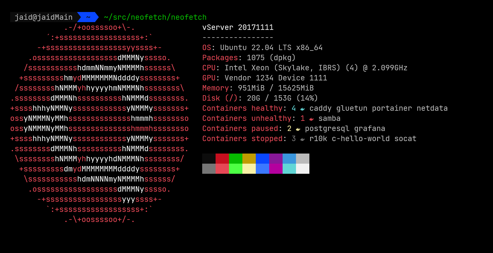

# neofetch-plugins

My custom [neofetch](https://github.com/dylanaraps/neofetch) plugins. Can be easily installed by copying the needed parts from [dist/exampleConfig.bash](https://github.com/Jaid/neofetch-plugins/blob/main/dist/exampleConfig.bash) and pasting them into your own `~/.config/neobash/config.conf`.



# Plugins

# Docker

- [containers_healthy](https://github.com/Jaid/neofetch-plugins/blob/main/plugins/containers_healthy.bash)
- [containers_unhealthy](https://github.com/Jaid/neofetch-plugins/blob/main/plugins/containers_unhealthy.bash)
- [containers_paused](https://github.com/Jaid/neofetch-plugins/blob/main/plugins/containers_paused.bash)
- [containers_stopped](https://github.com/Jaid/neofetch-plugins/blob/main/plugins/containers_stopped.bash)

# Config

```bash
# If on, Nerd Fonts icons will be used
# See https://github.com/ryanoasis/nerd-fonts
#
# Default: 'on'
# Values:  'on', 'off'
# Flag: --nerd_font
nerd_font="on"
```

# Download

Just copy whatever you need from the [dist](https://github.com/Jaid/neofetch-plugins/blob/main/dist) folder.

Alternatively, just import all plugins from web in your `~/.config/neobash/config.conf`:

```bash
source <(curl --silent --location https://raw.githubusercontent.com/Jaid/neofetch-plugins/main/dist/plugins.bash)

print_info() {
  info model
  info underline
  info "Containers healthy" containers_healthy
  info "Containers unhealthy" containers_unhealthy
  info "Containers paused" containers_paused
  info "Containers stopped" containers_stopped
  info cols
}
```